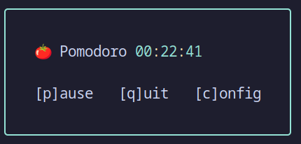

# 🍅 tomate-cli

A simple, terminal-based Pomodoro timer and stats tracker.

---

## Table of Contents

- [Features](#features)
- [Quick Start](#quick-start)
- [CLI Usage](#cli-usage)
- [Usage](#usage)
- [Windows Users](#windows-users)
- [Development](#development)
- [Configuration & Data](#configuration--data)
- [Custom Config and Metrics Paths](#custom-config-and-metrics-paths)
- [Dependencies](#dependencies)
- [License](#license)
- [Author](#author)

---

## 

---

## Features

- Pomodoro cycles with short/long breaks (configurable durations)
- Terminal UI with colorful, boxed countdown and controls
- Sound notifications (assets included)
- Session statistics: total Pomodoros, average per day/week, break times, and more
- Config menu: interactive, in-terminal
- Persistent config and metrics (JSON files in your home directory)
- Tested core logic (Vitest)

---

## Quick Start

### 1. Requirements

- Node.js v18+
- Unix-like shell (Linux, macOS, or [WSL2](https://docs.microsoft.com/en-us/windows/wsl/) on Windows)
- [yad](https://github.com/v1cont/yad) (for popup notifications, optional but recommended)

### 2. Install

```
git clone https://github.com/pfei/tomate-cli.git
cd tomate-cli
npm install
```

### 3. Build

```
npm run build
```

### 4. Run

#### Option 1: Use as a global CLI with `npm link`

```
npm link
tomate
```

#### Option 2: Run directly with Node

```
node ./dist/main.js
```

---

## CLI Usage

### Show help

With global CLI:

```
tomate --help
```

Or directly:

```
node ./dist/main.js --help
```

### Show stats

With global CLI:

```
tomate --stats
```

Or directly:

```
node ./dist/main.js --stats
```

---

### Example: `tomate --help`

```
  Usage: tomate-cli [options]

  Options:
    --help              Show this help message and exit
    --stats             Show productivity stats and exit
    --reset-config      Reset configuration to defaults
    --config-path <p>   Use a custom config file path
    --metrics-path <p>  Use a custom metrics file path

  Key Controls (while running):
    p     Pause/Resume timer
    q     Quit
    c     Open config menu
```

---

## Usage

### Controls

- `[p]` Pause/Resume timer
- `[q]` Quit
- `[c]` Open config menu

### Config Menu

- Change Pomodoro, short break, or long break durations (in seconds)
- Changes are saved and used for future sessions

### Statistics

- View stats using `tomate --stats` or `node ./dist/main.js --stats`
- Stats include total Pomodoros, average durations, break stats, and more

---

## Windows Users

> **Note:**  
> This project uses Unix shell commands (e.g., `rm -rf dist`) in its scripts.  
> **Windows users must use [WSL2](https://docs.microsoft.com/en-us/windows/wsl/) (Windows Subsystem for Linux) to build and run this project.**
> Native Windows shells are not supported.

---

## Development

- **Lint:** `npm run lint`
- **Format:** `npm run format`
- **Test:** `npm test`
- **Coverage:** `npm run coverage`
- **Clean build:** `npm run clean && npm run build`

---

## Configuration & Data

- Config and metrics are stored as JSON files in your home directory (e.g., `~/.config/tomate-cli/`).
- Sound assets are included and copied to `dist/` on build.

---

## Custom Config and Metrics Paths

By default, tomate-cli stores config and metrics in your home directory (e.g., `~/.config/tomate-cli/`).  
You can override these locations using the `--config-path` and `--metrics-path` options.

**Examples:**

```
# Use a custom config and metrics file location with the CLI
tomate --config-path ~/myconfigs/tomate-config.json --metrics-path ~/myconfigs/tomate-metrics.json

# Or, if running directly:
node ./dist/main.js --config-path ~/myconfigs/tomate-config.json --metrics-path ~/myconfigs/tomate-metrics.json
```

This is useful if you want to:

- Sync your config/metrics with cloud storage
- Keep multiple profiles
- Use temporary/test data

---

## Dependencies

- [boxen](https://github.com/sindresorhus/boxen)
- [chalk](https://github.com/chalk/chalk)
- [date-fns](https://date-fns.org/)
- [zod](https://github.com/colinhacks/zod)
- [Vitest](https://vitest.dev/) (for testing)
- [yad](https://github.com/v1cont/yad) (for optional popup notifications)

---

## License

MIT

---

## Author

Pierre Feilles  
[GitHub Profile](https://github.com/pfei)

---
